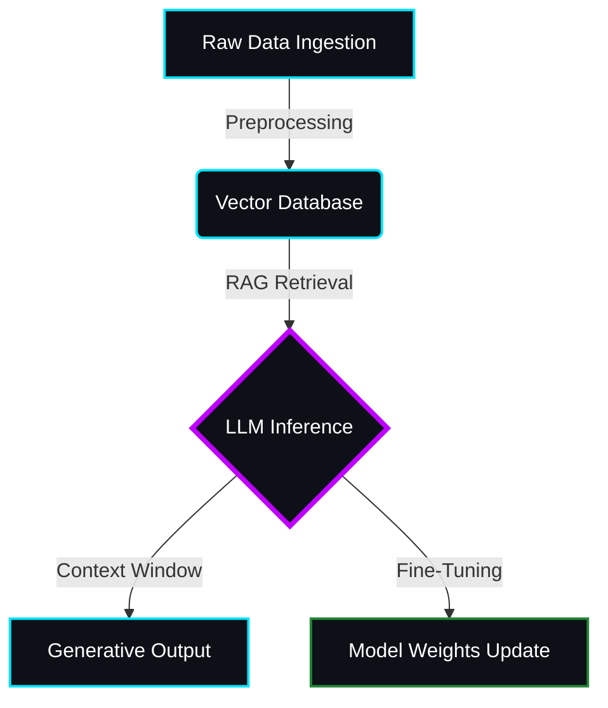

  

  <table border="0" width="100%">
    <tr>
      <td width="50%" align="center">
        
      </td>
      <td width="50%" align="center">
        
      </td>
    </tr>
    <tr>
      <td width="50%" align="center">
         
      </td>
      <td width="50%" align="center">
        
      </td>
    </tr>
  </table>

  <h3 align="left">🛠️ Neural Stack</h3>
  

    
  

   

<h3 align="left">🧠 Cognitive Architecture</h3>

<h3 align="left">🏙️ Contribution Topology</h3> 

